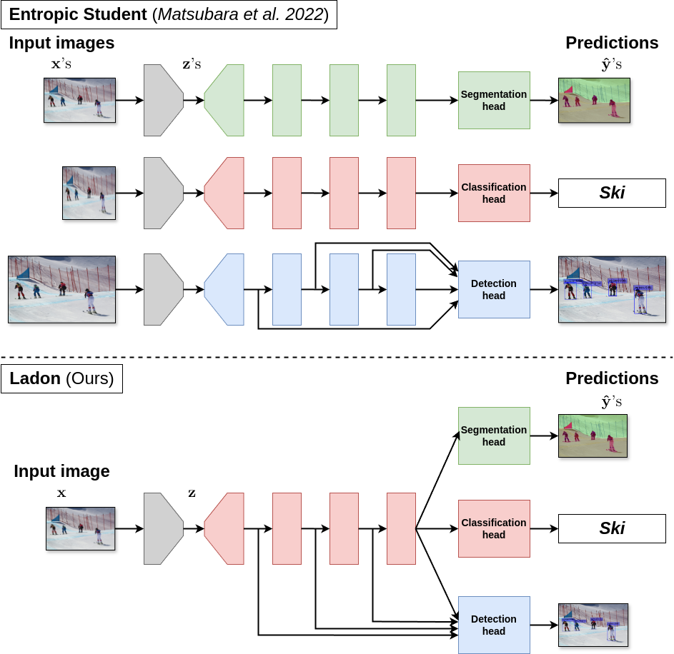

# A Multi-task Supervised Compression Model for Split Computing

This is the official repository for our WACV 2025 paper, ***"A Multi-task Supervised Compression Model for Split Computing"***.

## Ladon: the first multi-task supervised compression model for split computing


## Datasets
- Image classification: [ILSVRC 2012 (ImageNet)](https://www.image-net.org/challenges/LSVRC/2012/)
- Object detection: [COCO 2017](https://cocodataset.org/#detection-2017)
- Semantic segmentation: [PASCAL VOC 2012](http://host.robots.ox.ac.uk/pascal/VOC/voc2012/)

Follow the instructions in [my sc2-benchmark repository](https://github.com/yoshitomo-matsubara/sc2-benchmark/tree/main/script#datasets)

## Checkpoints
You can download our checkpoints including trained model weights [here](https://github.com/yoshitomo-matsubara/ladon-multi-task-sc2/releases/tag/wacv2025).  
Unzip the downloaded zip files under `./`, then there will be `./resource/ckpt/`.

## Legacy code
This study was done prior to the release of sc2bench v0.1.0, which introduces a lot of breaking changes and updates the structure of configuration files.
To reuse the code and configurations at that time, check the files in [./legacy/](./legacy/).  
If you want to use more recent versions of the required packages, refer to [Updated code](#updated-code)).

## Updated code

### Requirements
- Python >= 3.9
- sc2bench >= 0.1.0
- numpy

```shell
pipenv install
```

### Datasets
- Image classification: [ILSVRC 2012 (ImageNet)](https://www.image-net.org/challenges/LSVRC/2012/)
- Object detection: [COCO 2017](https://cocodataset.org/#detection-2017)
- Semantic segmentation: [PASCAL VOC 2012](http://host.robots.ox.ac.uk/pascal/VOC/voc2012/)

Follow the instructions in [my sc2-benchmark repository](https://github.com/yoshitomo-matsubara/sc2-benchmark/tree/main/legacy/script#datasets)

### Evaluation with checkpoints

Download our checkpoints including trained model weights [here](https://github.com/yoshitomo-matsubara/ladon-multi-task-sc2/releases/tag/wacv2025).  
Unzip the downloaded zip files under `./`, then there will be `./resource/ckpt/`.

#### 1. ImageNet (ILSVRC 2012): Image Classification

##### Ladon (ResNet-50) 
```shell
for beta in 0.32 1.28 5.12 10.24 20.48; do
  python scripts/image_classification.py -test_only -student_only \
    --config legacy/configs/ilsvrc2012/ladon/splittable_resnet50-fp-beta${beta}_from_resnet50.yaml \
    --run_log logs/ilsvrc2012/ladon/splittable_resnet50-fp-beta${beta}_from_resnet50.txt
done
```

##### Ladon (ResNeSt-269e) 
```shell
for beta in 0.32 1.28 5.12 10.24 20.48; do
  python scripts/image_classification.py -test_only -student_only \
    --config configs/ilsvrc2012/ladon/splittable_resnest269e-fp-beta${beta}_from_resnest269e.yaml \
    --run_log logs/ilsvrc2012/ladon/splittable_resnest269e-fp-beta${beta}_from_resnest269e.txt
done
```

#### 2. COCO 2017: Object Detection
##### Ladon (Faster R-CNN with ResNet-50 and FPN) 
```shell
for beta in 0.32 1.28 5.12 10.24 20.48; do
  python scripts/object_detection.py -test_only \
    --config configs/coco2017/ladon/faster_rcnn_splittable_resnet50-fp-beta${beta}_fpn.yaml \
    --run_log logs/coco2017/ladon/faster_rcnn_splittable_resnet50-fp-beta${beta}_fpn.txt
done
```

##### Ladon (Faster R-CNN with ResNeSt-269e and FPN) 
```shell
for beta in 0.32 1.28 5.12 10.24 20.48; do
  python scripts/object_detection.py -test_only \
    --config configs/coco2017/ladon/faster_rcnn_splittable_resnest269e-fp-beta${beta}_fpn.yaml \
    --run_log logs/coco2017/ladon/faster_rcnn_splittable_resnest269e-fp-beta${beta}_fpn.txt
done
```

#### 3. PASCAL VOC 2012: Semantic Segmentation
##### Ladon (DeepLabv3 with ResNet-50) 
```shell
for beta in 0.32 1.28 5.12 10.24 20.48; do
  python scripts/semantic_segmentation.py -test_only \
    --config configs/pascal_voc2012/ladon/deeplabv3_splittable_resnet50-fp-beta${beta}_two_stages.yaml \
    --run_log logs/pascal_voc2012/ladon/deeplabv3_splittable_resnet50-fp-beta${beta}_two_stages.txt
done
```

##### Ladon (DeepLabv3 with ResNeSt-269e) 
```shell
for beta in 0.32 1.28 5.12 10.24 20.48; do
  python scripts/semantic_segmentation.py -test_only \
    --config configs/pascal_voc2012/ladon/deeplabv3_splittable_resnest269e-fp-beta${beta}_two_stages.yaml \
    --run_log logs/pascal_voc2012/ladon/deeplabv3_splittable_resnest269e-fp-beta${beta}_two_stages.txt
done
```

#### Training

Use the same command as above but without `-test_only`.


## Citation
[[Preprint](https://arxiv.org/)]
```bibtex
Coming soon!
```
