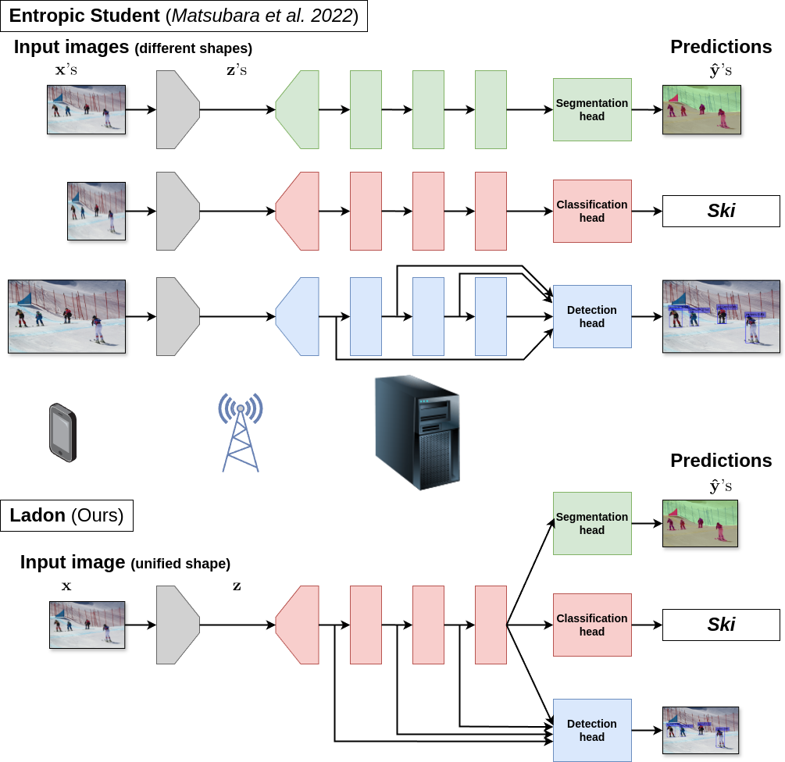

# A Multi-task Supervised Compression Model for Split Computing

This is the official repository for our WACV 2025 paper, ***"A Multi-task Supervised Compression Model for Split Computing"***.

## Ladon: the first multi-task supervised compression model for split computing


## Datasets
Follow the instructions in [my sc2-benchmark repository](https://github.com/yoshitomo-matsubara/sc2-benchmark/tree/main/script#datasets

## Checkpoints
You can download our checkpoints including trained model weights [here](https://github.com/yoshitomo-matsubara/ladon-multi-task-sc2/releases/tag/).  
Unzip the downloaded zip files under `./`, then there will be `./resource/ckpt/`.

## Legacy code
This study was done prior to the release of sc2bench v0.1.0, which introduces a lot of breaking changes and updates the structure of configuration files.
To reuse the code and configurations at that time, check the files in [./legacy/](./legacy/).  
If you want to use more recent versions of the required packages, refer to [Updated code](#updated-code)).

## Updated code
Coming soon!

### Requirements
- Python >= 3.9
- sc2bench >= 0.1.0

## Citation
[[Preprint](https://arxiv.org/)]
```bibtex
Coming soon!
```
